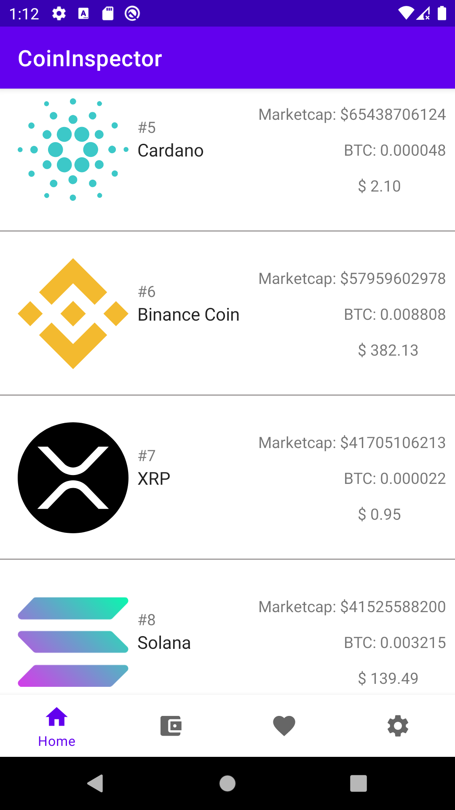

# CoinInspectorApp
Ann app who  shows the current price of cryptos.

## Features used:
- Retrofit2
- Shared Preferences
- Bottom Navigation View
- Coroutines
- MVVM
- ViewModel & LiveData
- ViewBinding
- Dependency Injection with Dagger Hilt
- RecyclerView
- Fragments
- Navigation Component
- ConstraintLayout
##
And more are coming soon! This project is in development yet!

